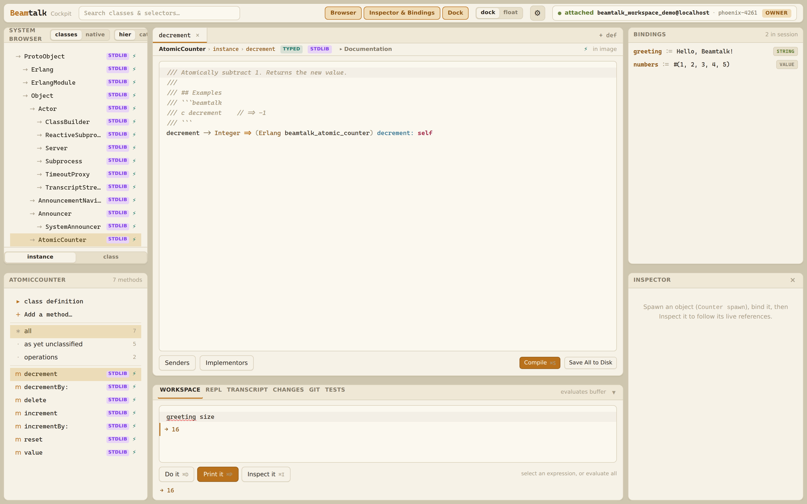

[](https://github.com/jamesc/beamtalk/actions/workflows/ci.yml)
[](https://www.beamtalk.dev/apidocs/)
[](https://github.com/jamesc/beamtalk/actions/workflows/ci.yml)
[](https://github.com/jamesc/beamtalk/actions/workflows/ci.yml)

<picture>
  <source srcset="docs/images/beamtalk-logo-dark.svg" media="(prefers-color-scheme: dark)" style="max-width: 480px; width: 100%; height: auto;" />
  <source srcset="docs/images/beamtalk-logo-light.svg" media="(prefers-color-scheme: light)" style="max-width: 480px; width: 100%; height: auto;" />
  
</picture>

**A live, interactive Smalltalk-like language for the BEAM VM**

Beamtalk brings Smalltalk's legendary live programming experience to Erlang's battle-tested runtime. While inspired by Smalltalk's syntax and philosophy, Beamtalk makes pragmatic choices for modern development (see [Syntax Rationale](docs/beamtalk-syntax-rationale.md)). Write code in a running system, hot-reload modules without restarts, and scale to millions of concurrent actors.

```beamtalk
// Spawn an actor with state
counter := Counter spawn

// Send messages (sync by default)
counter increment
counter increment
value := counter getValue // => 2


// Send an async message
counter increment!  // => ok
// Cascades - multiple messages to same receiver
Transcript show: "Hello"; cr; show: "World"

// Map literals
config := #{#host => "localhost", #port => 8080}
```

…and a live, browser-based IDE attached to the running system — system browser,
live method editing, and a workspace eval pane (the *[LiveView IDE](#liveview-ide)*):



---

## Why Beamtalk?

| Feature | Benefit |
|---------|---------|
| **Interactive-first** | REPL and live workspace, not batch compilation |
| **Hot code reload** | Edit and reload modules in running systems |
| **Actor model** | Actors are BEAM processes with independent fault isolation |
| **Gradual typing** | Opt-in `typed` classes with inference through generics, unions, FFI, and narrowing |
| **Reflection** | Inspect any actor's state and methods at runtime |
| **Runs on BEAM** | Compiles to Core Erlang; deploy to existing OTP infrastructure |
| **Native Erlang FFI** | Call any OTP function with typed specs and Result-shaped error coercion |

---

## What's New in 0.4

- **Type system grows teeth.** `typed` classes flow types through generics, unions, narrowing predicates, FFI calls, and method-local type variables; `beamtalk type-coverage` reports per-file coverage and the LSP shows *why* a chain decayed to `Dynamic`.
- **Real package manager.** `[dependencies]` in `beamtalk.toml` (path / git / hex), `beamtalk.lock`, `beamtalk deps add`, and qualified `pkg@Class` names — including native `.erl` inside packages, compiled via a vendored `rebar3`.
- **Result everywhere it counts.** FFI `{ok, T} | {error, R}` coerces to typed `Result(T, E)` at the boundary, and supervisor lifecycle calls return `Result` instead of raising.
- **Live-edit save model.** Method-level edits patch memory and append to a workspace `ChangeLog`; `Workspace flush` splices the body back into the `.bt` file atomically, with external-edit conflict detection.

See [CHANGELOG.md](CHANGELOG.md) for the full list, including named actor registration, the `internal` modifier, auto-chained `initialize`, and class crash recovery.

---

## Key Features

### Actors as Objects

Every Beamtalk actor is a BEAM process with its own state and mailbox:

```beamtalk
Actor subclass: Counter
  state: value = 0

  increment => self.value := self.value + 1
  decrement => self.value := self.value - 1
  getValue => self.value
```

### Pattern Matching

Match expressions with pattern arms:

```beamtalk
status match: [
  #ok -> "success"
  #error -> "failure"
  _ -> "unknown"
]

// Variable binding in patterns
42 match: [n -> n + 1]  // => 43
```

### Collections

Rich collection types written in Beamtalk itself:

```beamtalk
list := #(1, 2, 3)
list collect: [:x | x * 2]    // => #(2, 4, 6)

dict := #{#name => "Alice", #age => 30}
dict at: #name                 // => Alice
```

### Live Code Reloading

Redefine methods on running actors — state is preserved:

```beamtalk
// In the REPL: redefine a method on a running class
Counter >> increment => self.value := self.value + 10

// Existing actors immediately use the new code
c increment  // now adds 10 instead of 1
```
---

## Getting Started

### Install from Release

The quickest way to get started — downloads a prebuilt binary for your platform:

```bash
curl -fsSL https://jamesc.github.io/beamtalk/install.sh | sh
```

This installs to `~/.beamtalk/bin/`. You can customise the location:

```bash
curl -fsSL https://jamesc.github.io/beamtalk/install.sh | sh -s -- --prefix /usr/local
```

**Prerequisite:** [Erlang/OTP 27+](https://www.erlang.org/downloads) must be installed with `erl` on PATH.

<details>
<summary>Installing Erlang/OTP</summary>

**macOS (Homebrew):**
```bash
brew install erlang
```

**Ubuntu/Debian:**
```bash
sudo apt install erlang
```

**Windows:** Download the installer from [erlang.org](https://www.erlang.org/downloads).

**Version manager (any platform):** [asdf](https://asdf-vm.com/) with [asdf-erlang](https://github.com/asdf-vm/asdf-erlang):
```bash
asdf plugin add erlang
asdf install erlang 27.0
asdf global erlang 27.0
```
</details>

After installation, start the REPL:

```bash
beamtalk repl
```

### Build from Source

<details>
<summary>Prerequisites for building from source</summary>

- **Rust** (latest stable) — [rustup.rs](https://rustup.rs/)
- **Erlang/OTP 27+** with `erl` and `erlc` on PATH
- **rebar3** — Erlang build tool ([rebar3.org](https://rebar3.org/))
- **Just** — command runner (`cargo install just`)
- **Node.js LTS** (optional) — only for building the VS Code extension
</details>

```bash
# Clone and build
git clone https://github.com/jamesc/beamtalk.git
cd beamtalk
just build

# Start the REPL
just repl

# Run tests
beamtalk test              # Run BUnit TestCase tests
just test-stdlib           # Run compiled expression tests
just test-repl-protocol    # Run REPL TCP-protocol tests

# Run full CI checks
just ci
```

#### Install from Source

```bash
# Install to /usr/local (may need sudo)
just install

# Install to a custom prefix
just install PREFIX=$HOME/.local

# Uninstall
just uninstall PREFIX=$HOME/.local
```

The install layout follows the OTP convention (`PREFIX/lib/beamtalk/lib/<app>/ebin/`), so `beamtalk repl` and `beamtalk build` work correctly from any directory when the binary is on `PATH`.

After installing, verify your environment:

```bash
beamtalk doctor
```

### VS Code Extension (Local Dev)

For local extension development (debug LSP, no `.vsix` packaging):

```bash
just build-vscode
```

Then in VS Code, run **Developer: Install Extension from Location...** and select `editors/vscode`.

If your stdlib source files are outside the project root, set:

```json
{
  "beamtalk.stdlib.sourceDir": "/opt/beamtalk/stdlib/lib"
}
```

`beamtalk.stdlib.sourceDir` can be absolute (including outside the project) or relative to the Beamtalk project root (directory containing `beamtalk.toml`). See [editors/vscode/README.md](editors/vscode/README.md) for full extension configuration.

### LiveView IDE

A browser-based, Smalltalk-style live IDE that **attaches to a running Beamtalk
workspace** over Erlang distribution (the *Attach* topology) — Phoenix runs as
its own BEAM node and calls the same workspace functions the REPL uses, so what
you see in the browser is the live system, not a snapshot (pictured at the top).

What's in the cockpit:

- **System Browser** — a four-pane Smalltalk navigator (classes → protocols →
  methods → source) over the live image, including stdlib and runtime classes.
- **Method editor** — open any method as an editable tab with `CodeMirror` syntax
  highlighting; *Compile* redefines it on the running system (live code reload),
  with *Senders* / *Implementors* navigation and *Save All to Disk*.
- **Workspace** — a *Do it / Print it / Inspect it* eval pane returning live
  Erlang terms (not JSON), backed by a per-session workspace that persists state
  across evals, plus a live **Transcript**.
- **Bindings & Inspector** — workspace variables update live as you eval, and the
  Inspector follows a reference through the object graph and can track a live actor.

It ships on its **own release lane** — a self-contained release archive and a
Docker image (`ghcr.io/jamesc/beamtalk-ide`) — separate from the toolchain bundle.

- From source (contributors): `just web <workspace>` — see [editors/liveview/README.md](editors/liveview/README.md).
- Prebuilt archive: extract and run `bin/server <workspace-id>` — resolves the workspace's node + cookie like `just web` does. Archive/Docker install and remote (OIDC) deployment: [docs/deployment/remote-liveview-ide.md](docs/deployment/remote-liveview-ide.md).

### REPL Usage

**New to Beamtalk?** See the [REPL Tutorial](examples/repl-tutorial.md) for a complete beginner's guide!

```text
Beamtalk v0.4.0
Type :help for available commands, :exit to quit.

> message := "Hello, Beamtalk!"
"Hello, Beamtalk!"

> 2 + 3 * 4
14

> :load "examples/getting-started/src/hello.bt"
nil

> Hello new greeting
│ Hello, World!
a Hello
```

### Load Files

```text
> :load "examples/getting-started/src/counter.bt"
nil
```

---

## Development Setup

The fastest path is the **devcontainer**: open the repo in VS Code with the
[Dev Containers extension](https://marketplace.visualstudio.com/items?itemName=ms-vscode-remote.remote-containers),
click **Reopen in Container**, then run `just ci`. Everything — Rust, Erlang/OTP,
rebar3, Just, the GitHub CLI, and the editor extensions — comes pre-configured.

Prefer a local toolchain? Install [Rust](https://rustup.rs/), the BEAM tools via
[mise](https://mise.jdx.dev) (`mise install` reads the pinned `.tool-versions`),
and `cargo install just`, then `just ci`.

**[CONTRIBUTING.md](CONTRIBUTING.md)** has the full guide — devcontainer details,
GitHub/SSH commit-signing setup, the test layers, commit conventions, and the PR
workflow. For AI agent contributors, see **[AGENTS.md](AGENTS.md)**.

---

## Project Status

**Active development** — the compiler core is working with an interactive REPL.

### What Works Now

- ✅ **REPL** — Interactive evaluation with variable persistence, `:sync`, `:interrupt`, parallel `:test`
- ✅ **Lexer & Parser** — Full expression parsing with error recovery
- ✅ **Core Erlang codegen** — Compiles to BEAM bytecode via `erlc`
- ✅ **Actors & Supervision** — Spawn actors with state, sync/async messages, futures, OTP supervision with Result-shaped lifecycle, named registration
- ✅ **Field assignments** — Actor state mutations via `:=`
- ✅ **Method dispatch** — Full message routing (unary, binary, keyword)
- ✅ **Pattern matching** — `match:` expressions with literal, variable, and constructor patterns
- ✅ **Hot code reloading** — Redefine classes/methods on running actors via `>>`; class crash recovery preserves dispatch tables
- ✅ **Type system** — `typed` classes, generics, protocols, unions, control-flow narrowing, FFI inference, `Never`, `Self class`, local annotations
- ✅ **Package manager** — `beamtalk.toml` `[dependencies]` (path/git/hex), `beamtalk.lock`, qualified `pkg@Class` names, `beamtalk deps`
- ✅ **Native Erlang in packages** — `native/*.erl` compiled via vendored rebar3; `EUnit` runs through `beamtalk test`
- ✅ **Standard library** — Boolean, Block, Integer, Float, String, Character, Collections, Result, Printable, Package, Tracing
- ✅ **Class system** — Inheritance, `super`, `sealed`, `internal` access control, class-side methods, abstract classes, auto-chained `initialize`
- ✅ **Cascades, map literals, comprehensions, exception handling**
- ✅ **LSP** — Completions (incl. FFI), hover with type/Dynamic-reason, go-to-definition, find references, workspace symbols, diagnostics
- ✅ **Testing** — SUnit-style `TestCase`, parallel runner, `BUnit` + `EUnit` integration
- ✅ **Tooling** — `beamtalk doctor`, `beamtalk type-coverage`, `beamtalk generate native`, `beamtalk generate stubs`, MCP server, VS Code extension
- ✅ **LiveView IDE** — browser-based Smalltalk cockpit (system browser, live method editing, Workspace + Transcript, Bindings, Inspector) attached to a running workspace over Erlang distribution

---

## Documentation

📚 **[Documentation Index](docs/README.md)** — Start here for a guided tour
🌐 **[API Reference](https://www.beamtalk.dev/apidocs/)** — Standard library API docs (auto-generated)
📖 **[Documentation Site](https://jamesc.github.io/beamtalk/)** — Full docs including language features, principles, and architecture

### Core Documents

- [Design Principles](docs/beamtalk-principles.md) — 13 core principles guiding all decisions
- [Language Features](docs/beamtalk-language-features.md) — Syntax, semantics, and examples
- [Syntax Rationale](docs/beamtalk-syntax-rationale.md) — Why we keep/change Smalltalk conventions
- [Object Model](docs/ADR/0005-beam-object-model-pragmatic-hybrid.md) — How Smalltalk objects map to BEAM
- [Known Limitations](docs/known-limitations.md) — Current limitations

### Architecture

- [Architecture](docs/beamtalk-architecture.md) — Compiler pipeline, runtime, hot reload
- [Testing Strategy](docs/development/testing-strategy.md) — How we verify compiler correctness

### Tooling & Vision

- [Agent-Native Development](docs/beamtalk-agent-native-development.md) — AI agents as developers and live actor systems

---

## Examples & Standard Library

### Examples ([examples/](examples/))

Simple programs demonstrating language features:

```bash
cargo run -- repl
> :load "examples/getting-started/src/hello.bt"
```

### Standard Library ([stdlib/src/](stdlib/src/))

Foundational classes implementing "everything is a message":

| Class | Description |
|-------|-------------|
| `Actor` | Base class for all actors |
| `Block` | First-class closures |
| `True` / `False` | Boolean control flow |
| `Integer` / `Float` | Numeric types |
| `String` / `Character` | UTF-8 text and characters |
| `List` / `Tuple` | Ordered collections |
| `Set` / `Dictionary` | Unordered collections |
| `Nil` | Null object pattern |
| `TestCase` | SUnit-style test framework |

See [stdlib/src/README.md](stdlib/src/README.md) for full documentation.

---

## Repository Structure

```text
beamtalk/
├── crates/
│   ├── beamtalk-core/       # Lexer, parser, AST, codegen, type checker
│   ├── beamtalk-cli/        # Command-line interface & REPL
│   ├── beamtalk-lsp/        # Language server (LSP)
│   └── beamtalk-repl-protocol/ # Shared REPL response types
├── stdlib/src/              # Standard library (.bt files)
├── runtime/                 # Erlang runtime (actors, REPL backend)
├── stdlib/test/             # BUnit test cases (TestCase classes)
├── tests/
│   ├── repl-protocol/       # REPL TCP-protocol tests
│   └── parity/              # Cross-surface parity tests
├── docs/                    # Design documents & ADRs
├── examples/                # Example programs
└── editors/vscode/          # VS Code extension
```

The compiler is written in **Rust** and generates **Core Erlang**, which compiles to BEAM bytecode via `erlc`.

---

## Inspiration

Beamtalk combines ideas from:

- **Smalltalk/Newspeak** — Live programming, message-based syntax, reflection (inspiration, not strict compatibility)
- **Erlang/BEAM** — Actors, fault tolerance, hot code reload, distribution
- **Elixir** — Protocols, comprehensions, with blocks
- **Gleam** — Result types, exhaustive pattern matching
- **Dylan** — Sealing, conditions/restarts, method combinations
- **TypeScript** — Compiler-as-language-service architecture

---

## Contributing

We welcome contributions! See [CONTRIBUTING.md](CONTRIBUTING.md) for how to get started — covering dev setup, running tests, PR guidelines, and where to help.

For AI agent contributors, see [AGENTS.md](AGENTS.md) for detailed development guidelines.

We use [Linear](https://linear.app) for issue tracking (project prefix: `BT`).

---

## License

Licensed under the Apache License, Version 2.0. See [LICENSE](LICENSE) for details.
