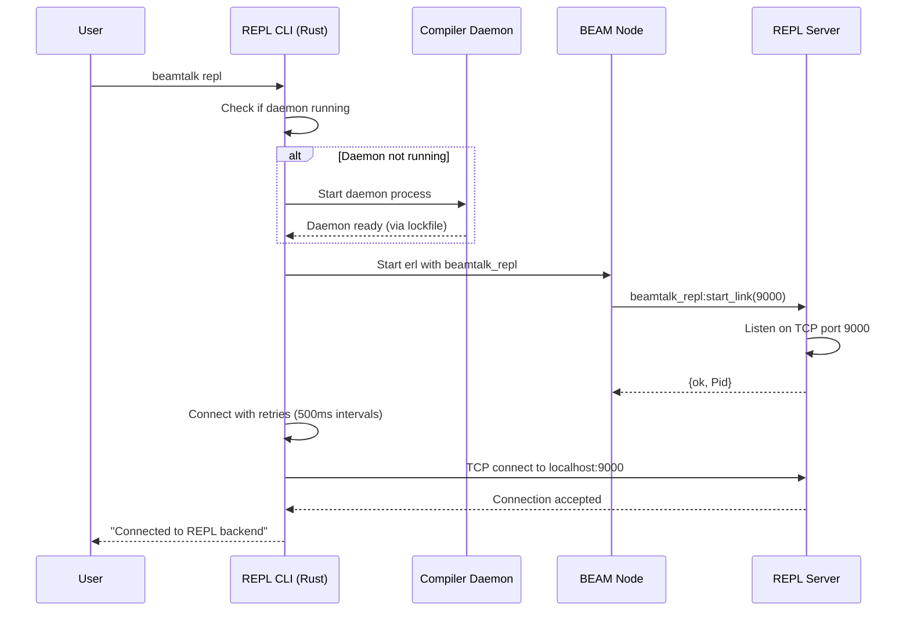
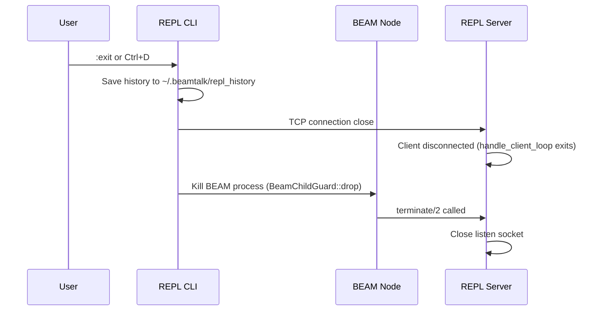
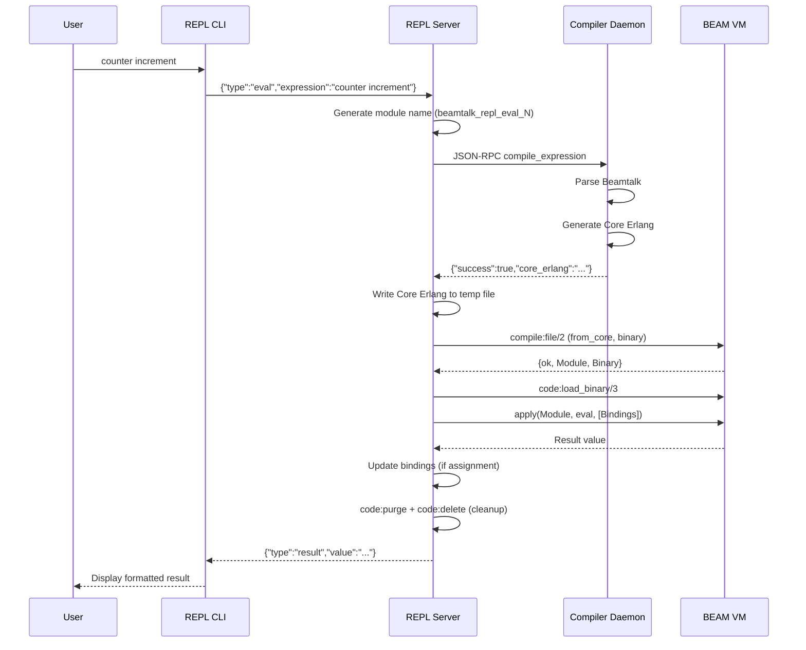

# REPL Architecture and State Management

This document describes the internal architecture of Beamtalk's interactive REPL (Read-Eval-Print Loop), including how expressions are compiled, evaluated, and how state persists across evaluations.

For the overall system architecture, see [beamtalk-architecture.md](beamtalk-architecture.md).

---

## Overview

The Beamtalk REPL provides an interactive environment for exploring and testing Beamtalk code. It supports:

- Expression evaluation with immediate feedback
- Persistent variable bindings across evaluations
- Actor spawning and interaction
- Loading `.bt` files to define classes
- Command history (persisted across sessions)

---

## Three-Component Architecture

The REPL system consists of three cooperating components:

```
┌─────────────────┐     ┌──────────────────────┐     ┌─────────────────┐
│  REPL CLI       │     │   BEAM Node          │     │ Compiler Daemon │
│  (Rust)         │────▶│  beamtalk_repl.erl   │────▶│ (Rust)          │
│  rustyline      │ TCP │  gen_server          │ Unix│ JSON-RPC        │
└─────────────────┘     └──────────────────────┘ sock└─────────────────┘
     Port 9000              localhost:9000         ~/.beamtalk/daemon.sock
```

### Component Responsibilities

| Component | Language | Purpose |
|-----------|----------|---------|
| **REPL CLI** | Rust | User interface, line editing, history, command dispatch |
| **REPL Server** | Erlang | Session state, expression coordination, bytecode loading |
| **Compiler Daemon** | Rust | Parsing, code generation, returns Core Erlang |

### Why This Architecture?

**Why not run everything in Rust?**

The evaluated code runs on the BEAM VM—spawned actors, message passing, and supervision all require the BEAM runtime. The REPL server runs *inside* the BEAM node so it can:

1. Load compiled bytecode directly into the running VM
2. Execute expressions in the same process space as spawned actors
3. Access actor PIDs and send messages to them
4. Benefit from BEAM's hot code reloading for live updates

**Why not run everything in Erlang?**

The Rust compiler provides 10-100x faster parsing and code generation than BEAM languages. Using a persistent daemon avoids the startup cost for each expression. The Rust CLI also provides better terminal interaction (rustyline) than Erlang's limited I/O.

**Why TCP instead of stdio?**

TCP allows the REPL server to accept multiple connections (though currently one at a time) and clearly separates the Rust process from the Erlang process. This makes debugging easier and allows future enhancements like remote REPL connections.

---

## Startup Sequence

When you run `beamtalk repl`, the following sequence occurs:



### Startup Steps in Detail

1. **Check daemon** (`is_daemon_running`): Looks for `~/.beamtalk/daemon.lock` containing a valid PID
2. **Start daemon** (if needed): Spawns `beamtalk daemon start --foreground` as background process
3. **Start BEAM node**: Runs `erl` with the runtime loaded, calling `beamtalk_repl:start_link(9000)`
4. **Connect with retries**: Attempts TCP connection up to 10 times with 500ms delays
5. **Ready**: User sees prompt `>`

### Shutdown Sequence



The `BeamChildGuard` in Rust ensures the BEAM process is killed even if the CLI exits abnormally (panic, Ctrl+C). The daemon continues running for future REPL sessions.

---

## Session State Management

Each TCP connection to the REPL server creates an independent session with isolated state.

### State Structure

```erlang
-record(state, {
    listen_socket :: gen_tcp:socket() | undefined,
    port :: inet:port_number(),
    bindings :: map(),                    % Variable name (atom) -> value
    daemon_socket_path :: string(),       % Path to daemon Unix socket
    eval_counter :: non_neg_integer(),    % For unique module names
    loaded_modules :: [atom()]            % Modules loaded via :load
}).
```

### Variable Bindings

Bindings are stored as an Erlang map from atom keys to arbitrary values:

```erlang
#{
    counter => <0.123.0>,    % Actor PID
    x => 42,                 % Integer
    name => <<"Alice">>,     % Binary string
    block => fun(X) -> X * 2 end  % Block (Erlang fun)
}
```

**Binding Lifecycle:**

| Operation | Bindings Before | Expression | Bindings After |
|-----------|-----------------|------------|----------------|
| Create | `#{}` | `x := 42` | `#{x => 42}` |
| Update | `#{x => 42}` | `x := 100` | `#{x => 100}` |
| Reference | `#{x => 100}` | `x + 8` | `#{x => 100}` (unchanged) |
| New binding | `#{x => 100}` | `y := x * 2` | `#{x => 100, y => 200}` |

**Binding Shadowing:**

Reassigning a variable replaces its value entirely. There's no lexical scoping within the REPL—all bindings are at the session level.

```
> x := 42
42
> x := "hello"
"hello"
> x
"hello"
```

### Session Isolation

Each TCP connection gets its own session with:
- Fresh bindings map (starts empty)
- Independent eval counter (starts at 0)
- Separate loaded_modules list

However, **actors are not isolated**. An actor spawned in one session continues running in the BEAM node and can be accessed from another session if you know its PID.

### Eval Counter and Module Naming

Each evaluation generates a unique module name using an incrementing counter:

```
Eval 1: x := 42      → beamtalk_repl_eval_0
Eval 2: x + 8        → beamtalk_repl_eval_1
Eval 3: Counter spawn → beamtalk_repl_eval_2
```

This ensures:
1. No module name collisions between evaluations
2. Clean code loading (each eval is a fresh module)
3. Easy debugging (module names indicate eval order)

---

## Expression Evaluation Flow

When you enter an expression, it flows through multiple components:



### Step-by-Step Details

#### 1. CLI Request Formatting

The CLI sends JSON over TCP (newline-delimited):

```json
{"type": "eval", "expression": "counter increment"}
```

#### 2. Server Request Parsing

The server parses JSON and extracts the expression:

```erlang
parse_request(Data) ->
    case parse_json(Data) of
        {ok, #{<<"type">> := <<"eval">>, <<"expression">> := Expr}} ->
            {eval, binary_to_list(Expr)};
        ...
    end.
```

#### 3. Daemon Compilation Request

The server sends a JSON-RPC 2.0 request to the daemon over Unix socket:

```json
{
  "jsonrpc": "2.0",
  "id": 12345,
  "method": "compile_expression",
  "params": {
    "source": "counter increment",
    "module_name": "beamtalk_repl_eval_5"
  }
}
```

#### 4. Core Erlang Generation

The daemon parses the expression and generates Core Erlang. For `counter increment`:

```erlang
module 'beamtalk_repl_eval_5' ['eval'/1]

'eval'/1 = fun (Bindings) ->
    let Counter = call 'maps':'get'('counter', Bindings)
    in call 'gen_server':'call'(Counter, {'increment', []})
```

#### 5. Bytecode Compilation

The server writes Core Erlang to a temp file and compiles:

```erlang
compile:file(TempFile, [from_core, binary, return_errors])
```

#### 6. Module Loading and Execution

```erlang
code:load_binary(beamtalk_repl_eval_5, "", Binary),
Result = apply(beamtalk_repl_eval_5, eval, [Bindings])
```

#### 7. Binding Update

If the expression was an assignment (`x := value`), update bindings:

```erlang
case extract_assignment(Expression) of
    {ok, VarName} ->
        NewBindings = maps:put(VarName, Result, Bindings);
    none ->
        %% Not an assignment, bindings unchanged
        Bindings
end
```

#### 8. Module Cleanup

Temporary eval modules are immediately purged:

```erlang
code:purge(beamtalk_repl_eval_5),
code:delete(beamtalk_repl_eval_5)
```

This prevents accumulation of modules in the code server.

---

## Error Handling

Errors can occur at multiple stages:

### Parse Errors (Daemon)

```
> x :=
Error: Unexpected end of input, expected expression
```

The daemon returns diagnostics with source locations:

```json
{
  "success": false,
  "diagnostics": [
    {"message": "Unexpected end of input", "severity": "error", "start": 4, "end": 4}
  ]
}
```

### Core Erlang Compile Errors

If generated Core Erlang is invalid (compiler bug):

```
Error: Core Erlang compile error: [{...}]
```

### Runtime Errors

Errors during evaluation are caught and reported:

```
> 1 / 0
Error: Evaluation error: error:badarith
```

```erlang
try
    apply(ModuleName, eval, [Bindings])
catch
    Class:Reason ->
        {error, {eval_error, Class, Reason}, NewState}
end
```

### Daemon Connection Errors

If the daemon isn't running:

```
Error: Compiler daemon not running. Start with: beamtalk daemon start --foreground
```

---

## Value Display Formatting

Results are serialized to JSON for transport, then formatted by the CLI.

### Type-Specific Formatting

| Beamtalk Type | JSON Representation | CLI Display |
|---------------|---------------------|-------------|
| Integer | `42` | `42` |
| Float | `3.14` | `3.14` |
| Boolean | `true`/`false` | `true`/`false` |
| String | `"hello"` | `hello` |
| Atom | `"ok"` (binary) | `ok` |
| Actor/PID | `"#Actor<0.123.0>"` | `#Actor<0.123.0>` |
| Block (fun) | `"a Block/2"` | `a Block/2` |
| List | `[1, 2, 3]` | `[1, 2, 3]` |
| Tuple | `{"__tuple__": [1, 2]}` | `(1, 2)` |
| Map | `{"key": "value"}` | `{key: value}` |

### Actor Display

Actors are displayed with their class name when known:

```erlang
term_to_json(Value) when is_pid(Value) ->
    PidStr = pid_to_list(Value),
    Inner = lists:sublist(PidStr, 2, length(PidStr) - 2),
    iolist_to_binary([<<"#Actor<">>, Inner, <<">">>]).
```

Example: `#Actor<0.123.0>` or `#Counter<0.123.0>` (when class is registered)

### Block Display

Blocks show their arity:

```erlang
term_to_json(Value) when is_function(Value) ->
    {arity, Arity} = erlang:fun_info(Value, arity),
    iolist_to_binary([<<"a Block/">>, integer_to_binary(Arity)]).
```

Example: `a Block/1`, `a Block/2`

---

## Actors in the REPL

Actors spawned in the REPL survive across evaluations because they run as independent BEAM processes.

### Actor Lifecycle

```
> counter := Counter spawn
#Counter<0.234.0>

> counter increment
1

> counter increment  
2

> counter getValue
2
```

The `counter` binding holds the PID `<0.234.0>`. The Counter process continues running in the BEAM node between evaluations.

### What Happens When the Session Ends?

When the REPL session ends (`:exit` or Ctrl+D):

1. **TCP connection closes** - Server's `handle_client_loop` exits
2. **Bindings are lost** - The session state is garbage collected
3. **Actors continue running** - They're not supervised by the REPL
4. **BEAM node terminates** - CLI kills the BEAM process via `BeamChildGuard`
5. **All actors die** - BEAM shutdown terminates all processes

If actors need to survive REPL restarts, they would need to be started in a separate BEAM node with proper supervision.

### Actor PIDs in Bindings

Actor PIDs are stored directly in the bindings map:

```erlang
#{counter => <0.234.0>}
```

When an expression references `counter`, the generated code extracts the PID:

```erlang
let Counter = call 'maps':'get'('counter', Bindings)
```

---

## Futures in the REPL

Beamtalk uses async-first message sending that returns futures. In the REPL:

### Basic Future Behavior

```
> future := agent longRunningTask
#Future<0.456.0>

> future await
"result after 5 seconds"
```

The future PID is bound like any other value. Calling `await` blocks until resolved.

### Implicit Await

For convenience, the REPL may implicitly await certain expressions (implementation-dependent).

---

## Loading Files

The `:load` command compiles and loads a `.bt` file:

```
> :load examples/counter.bt
Loaded Counter
```

### Load Process

1. **Read file** - Server reads file contents
2. **Derive module name** - From filename: `counter.bt` → `counter`
3. **Compile via daemon** - Uses `compile` method (not `compile_expression`)
4. **Load module** - `code:load_binary` (persistent, not deleted)
5. **Register classes** - With `beamtalk_classes` for lookup

### Reloading

The `:reload` command reloads the last loaded file:

```
> :reload
Reloaded Counter
```

This supports the edit-reload workflow during development.

---

## Command History

Command history is managed by the Rust CLI using `rustyline`.

### Storage Location

```
~/.beamtalk/repl_history
```

### History Behavior

- Loaded on REPL startup
- Saved on clean exit (`:exit`, Ctrl+D)
- Survives across sessions
- Uses readline-style navigation (up/down arrows)

---

## REPL Commands

| Command | Shortcut | Description |
|---------|----------|-------------|
| `:help` | `:h`, `:?` | Show help message |
| `:exit` | `:quit`, `:q` | Exit the REPL |
| `:clear` | | Clear all variable bindings |
| `:bindings` | `:b` | Show current bindings |
| `:load <path>` | `:l` | Load a `.bt` file |
| `:reload` | `:r` | Reload last loaded file |

---

## Troubleshooting

### "Compiler daemon not running"

The REPL requires the compiler daemon. Start it manually:

```bash
beamtalk daemon start --foreground
```

Or let the REPL auto-start it (default behavior).

### "Failed to connect to REPL backend"

The BEAM node may have failed to start. Check:

1. Erlang/OTP is installed (`erl -version`)
2. Runtime is built (`cd runtime && rebar3 compile`)
3. Port 9000 is available

### "Core Erlang compile error"

This indicates a compiler bug. The generated Core Erlang is invalid. Report with:

1. The expression that failed
2. Set `BEAMTALK_DEBUG=1` to see generated code

### Actors not responding

If a spawned actor doesn't respond:

1. Check it's still alive: The REPL displays PIDs, use `is_process_alive/1` in Erlang
2. Actor may have crashed—no supervisor restarts it in REPL mode
3. Respawn with `newActor := MyClass spawn`

---

## Implementation Files

| File | Description |
|------|-------------|
| `crates/beamtalk-cli/src/commands/repl.rs` | Rust CLI, TCP client, line editing |
| `runtime/src/beamtalk_repl.erl` | Erlang gen_server, session state, evaluation |
| `crates/beamtalk-cli/src/commands/daemon.rs` | Compiler daemon, `compile_expression` handler |
| `crates/beamtalk-core/src/erlang.rs` | Core Erlang code generation |

---

## See Also

- [beamtalk-architecture.md](beamtalk-architecture.md) — Overall system architecture
- [beamtalk-ide.md](beamtalk-ide.md) — IDE and live development environment
