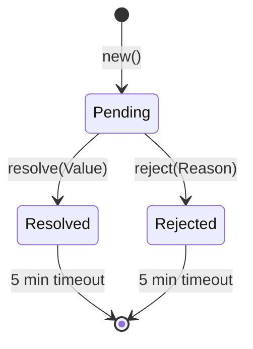
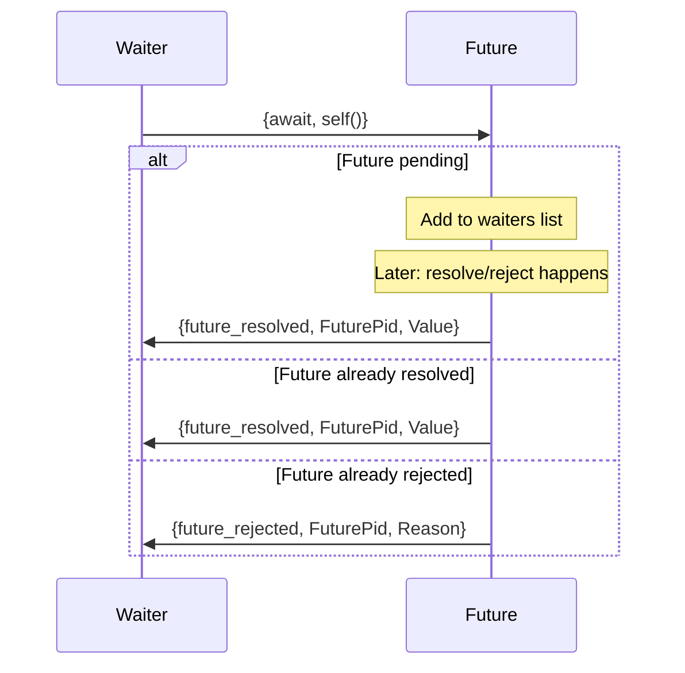

# Beamtalk Network Protocols

**Status:** In Progress - Core protocols defined, future extensions planned

This document describes the internal protocols used for communication between Beamtalk components: the compiler daemon JSON-RPC API, the actor message protocol, and the future resolution protocol.

For the CLI ↔ REPL protocol, see [repl-protocol.md](../repl-protocol.md) (the authoritative reference). For architecture context, see [beamtalk-architecture.md](../beamtalk-architecture.md).

---

## Overview

The Beamtalk system uses three main communication protocols:

```
┌─────────────────┐         ┌─────────────────────────────────┐
│   REPL CLI      │  TCP    │         BEAM Node               │
│   (Rust)        │◄───────►│                                 │
│                 │ :49152  │  ┌─────────────────────────┐    │
└─────────────────┘         │  │   REPL Backend          │    │
                            │  │   (beamtalk_repl.erl)   │    │
                            │  └───────────┬─────────────┘    │
                            │              │                  │
                            │              │ Actor Messages   │
                            │              ▼                  │
                            │  ┌─────────────────────────┐    │
                            │  │   Beamtalk Actors       │    │
                            │  │   (gen_server)          │    │
                            │  └─────────────────────────┘    │
                            └─────────────────────────────────┘
                                           ▲
                                           │ Unix Socket
                                           │ JSON-RPC 2.0
┌─────────────────┐                        │
│ Compiler Daemon │◄───────────────────────┘
│ (Rust)          │  ~/.beamtalk/daemon.sock
│                 │
│ LSP, REPL, CLI  │◄─── Other Clients
└─────────────────┘
```

| Protocol | Transport | Reference |
|----------|-----------|-----------|
| CLI ↔ REPL Backend | TCP (localhost:49152) | [repl-protocol.md](../repl-protocol.md) |
| Clients ↔ Compiler Daemon | Unix socket | [Below](#compiler-daemon-protocol-json-rpc-20) |
| Actor Messages | BEAM process messages | [Below](#actor-message-protocol) |
| Future Resolution | BEAM process messages | [Below](#future-resolution-protocol) |

---

## Compiler Daemon Protocol (JSON-RPC 2.0)

**Transport:** Unix socket at `~/.beamtalk/daemon.sock`  
**Format:** Newline-delimited JSON-RPC 2.0  
**Implementation:** `crates/beamtalk-cli/src/commands/daemon.rs`

### Daemon Lifecycle

```bash
# Start daemon (foreground mode)
beamtalk daemon start --foreground

# Check status
beamtalk daemon status

# Stop daemon
beamtalk daemon stop
```

**Files:**
- Socket: `~/.beamtalk/daemon.sock`
- Lockfile: `~/.beamtalk/daemon.lock` (contains PID)

### JSON-RPC 2.0 Framing

Each message is a single JSON object on one line, terminated by newline (`\n`).

**Request format:**
```json
{
  "jsonrpc": "2.0",
  "id": 1,
  "method": "<method_name>",
  "params": { ... }
}
```

**Success response:**
```json
{
  "jsonrpc": "2.0",
  "id": 1,
  "result": { ... }
}
```

**Error response:**
```json
{
  "jsonrpc": "2.0",
  "id": 1,
  "error": {
    "code": -32600,
    "message": "Invalid Request"
  }
}
```

### Error Codes

#### Standard Codes

| Code | Name | Description |
|------|------|-------------|
| -32700 | Parse Error | Invalid JSON |
| -32600 | Invalid Request | Not a valid JSON-RPC request |
| -32601 | Method Not Found | Unknown method name |
| -32602 | Invalid Params | Invalid method parameters |
| -32603 | Internal Error | Unexpected server-side error |

#### Custom Codes

Custom error codes are in the -32000 to -32099 range, reserved for implementation-defined server errors per JSON-RPC 2.0.

| Code | Name | Description |
|------|------|-------------|
| -32001 | File Read Error | Cannot read source file from disk |

### Methods

#### `ping`

Health check to verify daemon is running.

**Request:**
```json
{
  "jsonrpc": "2.0",
  "id": 1,
  "method": "ping"
}
```

**Response:**
```json
{
  "jsonrpc": "2.0",
  "id": 1,
  "result": "pong"
}
```

#### `compile`

Compile a Beamtalk source file to Core Erlang.

**Request:**
```json
{
  "jsonrpc": "2.0",
  "id": 1,
  "method": "compile",
  "params": {
    "path": "/project/src/counter.bt",
    "source": "Actor subclass: Counter ..."
  }
}
```

| Parameter | Type | Required | Description |
|-----------|------|----------|-------------|
| `path` | string | Yes | File path (used for module name derivation) |
| `source` | string | No | Source code. If omitted, reads from `path` |

**Response (success):**
```json
{
  "jsonrpc": "2.0",
  "id": 1,
  "result": {
    "success": true,
    "beam_path": null,
    "core_erlang": "module 'counter' ...",
    "diagnostics": [],
    "classes": ["Counter"]
  }
}
```

**Response (with errors):**
```json
{
  "jsonrpc": "2.0",
  "id": 1,
  "result": {
    "success": false,
    "beam_path": null,
    "core_erlang": null,
    "diagnostics": [
      {
        "message": "Unexpected token",
        "severity": "error",
        "start": 42,
        "end": 45
      }
    ],
    "classes": []
  }
}
```

#### `compile_expression`

Compile a single expression for REPL evaluation.

**Request:**
```json
{
  "jsonrpc": "2.0",
  "id": 1,
  "method": "compile_expression",
  "params": {
    "source": "x := 42",
    "module_name": "beamtalk_repl_eval_0"
  }
}
```

| Parameter | Type | Required | Description |
|-----------|------|----------|-------------|
| `source` | string | Yes | Expression source code |
| `module_name` | string | Yes | Unique module name for this evaluation |

**Response (success):**
```json
{
  "jsonrpc": "2.0",
  "id": 1,
  "result": {
    "success": true,
    "core_erlang": "module 'beamtalk_repl_eval_0' ...",
    "diagnostics": []
  }
}
```

#### `diagnostics`

Get diagnostics (errors, warnings) for a file without full compilation.

**Request:**
```json
{
  "jsonrpc": "2.0",
  "id": 1,
  "method": "diagnostics",
  "params": {
    "path": "/project/src/counter.bt",
    "source": "..."
  }
}
```

**Response:**
```json
{
  "jsonrpc": "2.0",
  "id": 1,
  "result": [
    {
      "message": "Undefined variable: foo",
      "severity": "error",
      "start": 100,
      "end": 103
    }
  ]
}
```

#### `shutdown`

Gracefully stop the daemon.

**Request:**
```json
{
  "jsonrpc": "2.0",
  "id": 1,
  "method": "shutdown"
}
```

**Response:**
```json
{
  "jsonrpc": "2.0",
  "id": 1,
  "result": null
}
```

### Diagnostic Object

```json
{
  "message": "Human-readable error message",
  "severity": "error",
  "start": 42,
  "end": 50
}
```

| Field | Type | Description |
|-------|------|-------------|
| `message` | string | Human-readable diagnostic message |
| `severity` | string | `"error"` or `"warning"` |
| `start` | number | Start byte offset in source |
| `end` | number | End byte offset in source |

### Connection Example (Erlang)

```erlang
%% Connect to daemon
{ok, Socket} = gen_tcp:connect({local, "~/.beamtalk/daemon.sock"}, 0,
                               [binary, {active, false}, {packet, line}]),

%% Send request
Request = jsx:encode(#{
    <<"jsonrpc">> => <<"2.0">>,
    <<"id">> => 1,
    <<"method">> => <<"ping">>
}),
gen_tcp:send(Socket, [Request, <<"\n">>]),

%% Receive response
{ok, ResponseLine} = gen_tcp:recv(Socket, 0, 5000),
Response = jsx:decode(ResponseLine, [return_maps]),
%% Response = #{<<"jsonrpc">> => <<"2.0">>, <<"id">> => 1, <<"result">> => <<"pong">>}

gen_tcp:close(Socket).
```

---

## Actor Message Protocol

**Transport:** BEAM process messages via `gen_server`  
**Format:** Erlang terms  
**Implementation:**
- `runtime/apps/beamtalk_runtime/src/beamtalk_actor.erl`
- `runtime/apps/beamtalk_runtime/src/beamtalk_future.erl`

### Overview

Every Beamtalk actor is a BEAM process running a `gen_server`. Message sends compile to either asynchronous casts (returning futures) or synchronous calls.

### Async Message Format (Cast)

Async messages return a future immediately. The result is delivered later via the future.

**Message format:**
```erlang
{Selector, Args, FuturePid}
```

| Field | Type | Description |
|-------|------|-------------|
| `Selector` | atom | Message selector (e.g., `increment`, `'at:put:'`) |
| `Args` | list | Argument list |
| `FuturePid` | pid | Future process to resolve with result |

**Example:**
```erlang
%% Beamtalk: counter increment
FuturePid = beamtalk_future:new(),
gen_server:cast(CounterPid, {increment, [], FuturePid}),
%% Returns FuturePid immediately

%% Beamtalk: array at: 1 put: 'hello'
FuturePid = beamtalk_future:new(),
gen_server:cast(ArrayPid, {'at:put:', [1, <<"hello">>], FuturePid}),
```

### Sync Message Format (Call)

Sync messages block until the result is available.

**Message format:**
```erlang
{Selector, Args}
```

**Example:**
```erlang
%% Synchronous call
Result = gen_server:call(CounterPid, {getValue, []})
```

### Message Dispatch

```mermaid
sequenceDiagram
    participant Sender
    participant Actor as Actor (gen_server)
    participant Future

    Note over Sender: Async message send
    Sender->>Future: beamtalk_future:new()
    Sender->>Actor: cast({Selector, Args, FuturePid})
    Sender->>Sender: Continue with FuturePid

    Actor->>Actor: dispatch(Selector, Args, State)
    alt Method found
        Actor->>Actor: Execute method
        Actor->>Future: resolve(FuturePid, Result)
    else Method not found
        alt has doesNotUnderstand handler
            Actor->>Actor: Call DNU handler
            Actor->>Future: resolve(FuturePid, Result)
        else no handler
            Actor->>Future: reject(FuturePid, {unknown_message, Selector})
        end
    end
```

The dispatch function looks up the method in the actor's `__methods__` map:

```erlang
dispatch(Selector, Args, State) ->
    Methods = maps:get('__methods__', State),
    case maps:find(Selector, Methods) of
        {ok, Fun} when is_function(Fun, 2) ->
            Fun(Args, State);
        error ->
            handle_dnu(Selector, Args, State)
    end.
```

### doesNotUnderstand Handler

When a message selector is not found, the actor attempts to call `doesNotUnderstand:args:` if defined:

```erlang
handle_dnu(Selector, Args, State) ->
    Methods = maps:get('__methods__', State),
    case maps:find('doesNotUnderstand:args:', Methods) of
        {ok, DnuFun} ->
            DnuFun([Selector, Args], State);
        error ->
            {error, {unknown_message, Selector}, State}
    end.
```

**Beamtalk example:**
```
Actor subclass: Proxy
  state: target = nil

  doesNotUnderstand: selector args: args =>
    self.target perform: selector withArgs: args
```

### Method Return Values

Methods can return one of three response tuples:

| Return | Meaning |
|--------|---------|
| `{reply, Result, NewState}` | Method returned a value |
| `{noreply, NewState}` | Method completed without a return value (resolves future with `nil`) |
| `{error, Reason, State}` | Method failed (rejects future with reason) |

### Actor State Structure

Each actor maintains state in a map:

```erlang
#{
  '__class__' => 'Counter',
  '__methods__' => #{
    increment => fun handle_increment/2,
    decrement => fun handle_decrement/2,
    getValue => fun handle_getValue/2,
    'incrementBy:' => fun 'handle_incrementBy:'/2
  },
  %% User-defined state fields
  value => 0
}
```

---

## Future Resolution Protocol

**Transport:** BEAM process messages  
**Implementation:** `runtime/apps/beamtalk_runtime/src/beamtalk_future.erl`

### Future States



### Messages to Future Process

| Message | Description |
|---------|-------------|
| `{resolve, Value}` | Transition to resolved state with Value |
| `{reject, Reason}` | Transition to rejected state with Reason |
| `{await, Pid}` | Register Pid to be notified when complete |
| `{await, Pid, Timeout}` | Register Pid with timeout (milliseconds) |
| `{add_callback, resolved, Fun}` | Register callback for resolved state |
| `{add_callback, rejected, Fun}` | Register callback for rejected state |

### Messages from Future Process

| Message | Description |
|---------|-------------|
| `{future_resolved, FuturePid, Value}` | Future was resolved with Value |
| `{future_rejected, FuturePid, Reason}` | Future was rejected with Reason |
| `{future_timeout, FuturePid}` | Await timed out |

### Await Sequence



### Await with Timeout

```erlang
%% Request await with 5 second timeout
FuturePid ! {await, self(), 5000},

receive
    {future_resolved, FuturePid, Value} ->
        {ok, Value};
    {future_rejected, FuturePid, Reason} ->
        {error, Reason};
    {future_timeout, FuturePid} ->
        {error, timeout}
after 5000 ->
    {error, timeout}
end.
```

### Callback Registration

```erlang
%% Register callbacks (non-blocking)
FuturePid ! {add_callback, resolved, fun(Value) ->
    io:format("Got value: ~p~n", [Value])
end},
FuturePid ! {add_callback, rejected, fun(Reason) ->
    io:format("Got error: ~p~n", [Reason])
end}.
```

Callbacks are executed in a separate spawned process to avoid blocking the future.

### Future Lifecycle

1. **Creation**: `beamtalk_future:new()` spawns a new process in `pending` state
2. **Resolution**: Either `resolve(Value)` or `reject(Reason)` transitions state
3. **Notification**: All registered waiters and callbacks are notified
4. **Cleanup**: After 5 minutes of inactivity in resolved/rejected state, process terminates
5. **Garbage Collection**: BEAM GC cleans up when no references remain

### Usage Example

```erlang
%% Create and resolve
Future = beamtalk_future:new(),
spawn(fun() ->
    Result = expensive_computation(),
    beamtalk_future:resolve(Future, Result)
end),

%% Await result (blocking)
Value = beamtalk_future:await(Future),

%% Or with timeout
case beamtalk_future:await(Future, 5000) of
    {ok, Value} -> handle_success(Value);
    {error, timeout} -> handle_timeout();
    {error, Reason} -> handle_error(Reason)
end.
```

---

## References

- [JSON-RPC 2.0 Specification](https://www.jsonrpc.org/specification)
- [Erlang gen_server Behaviour](https://www.erlang.org/doc/man/gen_server.html)
- [Beamtalk Architecture](../beamtalk-architecture.md)
